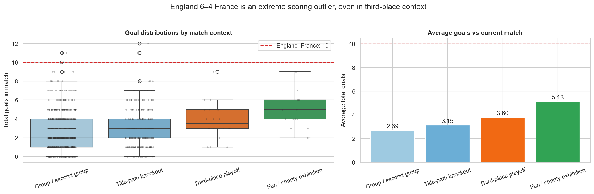
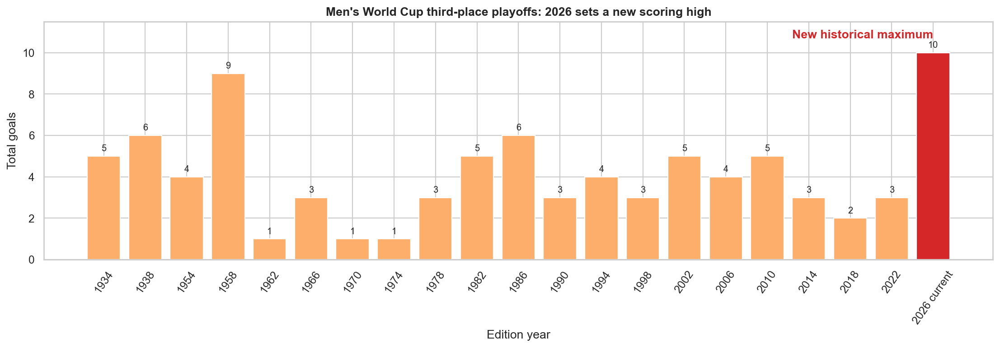
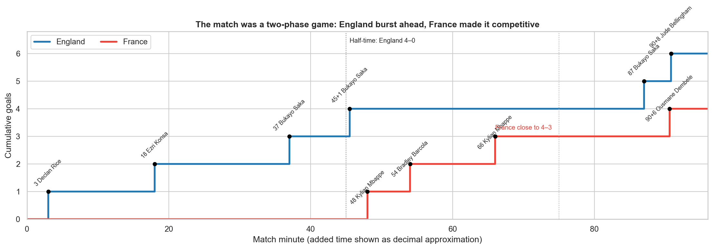
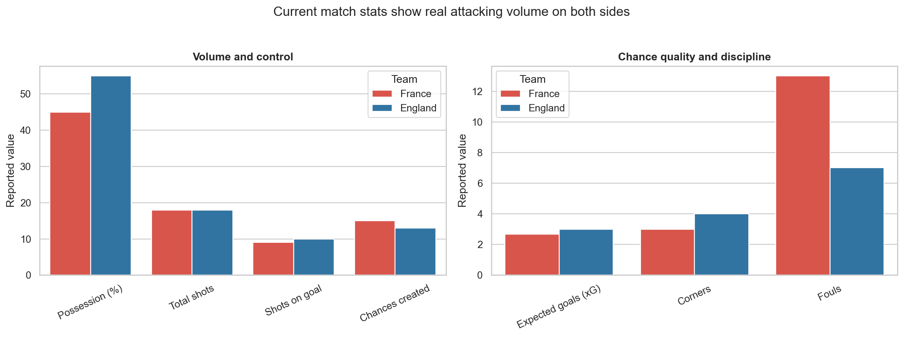

# England vs France 6–4: competitive World Cup match or just fun?

## Bottom line

England–France was **official and genuinely competitive, but lower-stakes than the final**.

It was the FIFA World Cup third-place playoff, so it was not a friendly or exhibition. The match awarded the bronze-medal position rather than the world title, which makes “lower stakes” a fair description. But the actual contest was not a relaxed kickabout: England led 4–0 at half-time, France fought back to 4–3 by the 66th minute, and the game ended with three goals from the 75th minute onward.

The best description is:

> **A lower-stakes official match with charity-match-like risk-taking.**

## What happened in the match

| Measure | France | England |
|---|---:|---:|
| Final score | 4 | 6 |
| Possession | 45% | 55% |
| Total shots | 18 | 18 |
| Shots on goal | 9 | 10 |
| Expected goals (xG) | 2.67 | 3.00 |
| Chances created | 15 | 13 |
| Passing accuracy | 92% | 93% |
| Fouls | 13 | 7 |
| Yellow cards | 0 | 0 |

The match produced 10 goals and 36 total shots. England never trailed, but France cut a four-goal deficit to one. England restored a two-goal lead with Bukayo Saka’s 87th-minute penalty; Ousmane Dembélé made it 5–4 at 90+6, before Jude Bellingham scored at 90+8.

The goal chronology and final match report are recorded in the local [goal snapshot](../data/current_match_goals.csv) and sourced from [11v11](https://www.11v11.com/matches/france-v-england-18-july-2026-393896/). The box-score figures are from [FOX Sports](https://www.foxsports.com/soccer/fifa-world-cup-men-france-vs-england-jul-18-2026-game-boxscore-607933?tab=boxscore).

## Historical comparison

The reused Fjelstul World Cup database contains 964 men's World Cup matches through 2022. I classified matches as:

- **Third-place playoff:** lower-stakes/bronze-medal context.
- **Title-path knockout:** round of 16, quarter-final, semi-final, or final.
- **Group/second-group:** official tournament baseline.
- **Soccer Aid charity exhibition:** England vs World XI celebrity/former-player charity matches from 2006–2026.

“High-scoring” means at least five total goals. “One-goal game” means the final score margin was exactly one.

| Match context | Matches | Avg goals | Median | Avg final margin | One-goal games | 5+ goals |
|---|---:|---:|---:|---:|---:|---:|
| Group / second-group | 718 | 2.69 | 2.0 | 1.49 | 37.2% | 14.5% |
| Title-path knockout | 226 | 3.15 | 3.0 | 1.48 | 45.1% | 23.9% |
| Third-place playoff | 20 | 3.80 | 3.5 | 1.60 | 60.0% | 35.0% |
| Soccer Aid charity exhibition | 15 | 5.13 | 5.0 | 1.13 | 33.3% | 53.3% |
| England–France 2026 | 1 | 10.00 | — | 2.00 | 0.0% | 100.0% |

The 2026 match exceeded the previous men's third-place maximum of nine goals, set by France’s 6–3 win over West Germany in 1958. The Associated Press also reported it as the highest-scoring World Cup game since Hungary beat El Salvador 10–1 in 1982 and the highest-scoring third-place match.

The direct fun-match comparison supports your intuition more clearly than the original official-vs-serious comparison: Soccer Aid averaged 5.13 goals and had 53.3% matches with at least five goals, while third-place playoffs averaged 3.80 and had 35.0%. However, England–France's 10 goals exceeded every one of the 15 Soccer Aid matches; Soccer Aid's previous high was 9 goals in 2024 and 2025.

## Statistical tests

The tests are exploratory because the third-place sample is small and matches within a tournament are not fully independent.

| Comparison | Mean difference | Bootstrap 95% CI | Mann–Whitney p | Permutation p | Fisher p for 5+ goals | Cliff’s delta |
|---|---:|---:|---:|---:|---:|---:|
| Third-place minus title-path knockout | +0.654 | −0.202 to +1.574 | 0.111 | 0.178 | 0.285 | 0.212 |
| Third-place minus group/second-group | +1.108 | +0.287 to +1.991 | 0.008 | 0.010 | 0.021 | 0.344 |
| Third-place minus Soccer Aid charity exhibition | −1.333 | −2.667 to −0.033 | 0.063 | 0.069 | 0.321 | −0.370 |

Interpretation:

- Third-place playoffs are clearly more open-scoring than group/second-group matches in this sample.
- Against title-path knockout matches—the better “serious football” comparator—the third-place goal average is higher, but the evidence is not statistically conclusive at the 5% level.
- Against Soccer Aid, third-place matches average 1.33 fewer goals; the p-values are close to, but above, 0.05 because the charity sample has only 15 matches.
- Therefore, the data supports **“England–France looked like a low-pressure scoring spectacle”**, but not the stronger claim that the teams treated it exactly like a charity match.

## Other signals

From 1970 onward, the reused bookings data shows average yellow cards of 2.93 in third-place playoffs, versus 4.14 in title-path knockout matches and 3.12 in group/second-group matches. This does not prove lower intensity: carding norms changed across eras and only 14 men's third-place matches are available in this period. It does suggest that the third-place format does not consistently produce more disciplinary tension than title-path knockout football.

The current match was also not a low-event fluke: the teams registered 18 shots each, 19 shots on goal combined, and 5.67 combined xG. England had the slightly stronger reported xG (3.00–2.67) and possession (55%–45%), while France created more chances (15–13).

Soccer Aid is an imperfect control: it mixes celebrities, former professionals, and current/retired players, so player quality and incentives are different. Its value here is behavioral—it is a recognizable low-pressure charity-exhibition sample where open scoring is expected—not that it is a tactical match-for-match equivalent.

## Final verdict

| Question | Answer |
|---|---|
| Was it official? | Yes. It was a FIFA World Cup third-place playoff. |
| Was it a friendly? | No. It counted as a World Cup match and awarded third place. |
| Was it lower-stakes than the final? | Yes. It did not decide the champion. |
| Was the actual contest competitive? | Yes. France came back from 0–4 to 3–4 and threatened to level the game. |
| Did it resemble a fun/charity match? | In scoring openness, yes: 10 goals, more than every Soccer Aid match in the 2006–2026 sample. |
| Was it unusually open and entertaining? | Extremely. Ten goals set a third-place scoring record. |

## Reproducibility and caveats

The full runnable analysis is in [the Jupyter notebook](jupyter-notebook/england_france_2026_third_place_analysis.ipynb). It reuses the sibling project’s pinned Fjelstul files at C:\Users\miqba\projects\Argentina Comeback Analysis\data\raw\fjelstul and reads the local [current-match goal snapshot](../data/current_match_goals.csv) plus [Soccer Aid results](../data/soccer_aid_results.csv).

Important limitations:

- Only 20 men's third-place playoffs are available through 2022, and the Soccer Aid benchmark has 15 matches.
- Soccer Aid is not a like-for-like control: its squads mix celebrities, former professionals, and current/retired players.
- Historical data does not contain a consistent possession/xG/shots panel, so current box-score statistics are shown separately rather than tested against historical xG.
- A final-margin comparison is structurally affected by knockout rules: third-place games must produce a placement, while group matches can finish drawn.
- A statistical test describes historical association; it cannot measure individual player motivation or establish why a match was more open.

## Sources

- [Fjelstul World Cup Database, pinned commit](https://github.com/jfjelstul/worldcup/tree/35a8667f518b07469182ae16d35574dd0e7a00fb/data-csv)
- [11v11: France v England, 18 July 2026](https://www.11v11.com/matches/france-v-england-18-july-2026-393896/)
- [Associated Press: Saka’s hat trick lifts England past Mbappé and France 6–4](https://apnews.com/article/world-cup-england-france-third-place-score-52f94eda6ff6d268d38aaefbc446c525)
- [FOX Sports match box score](https://www.foxsports.com/soccer/fifa-world-cup-men-france-vs-england-jul-18-2026-game-boxscore-607933?tab=boxscore)
- [England Football third-place playoff stat pack](https://www.englandfootball.com/articles/2026/Jul/16/app-england-france-world-cup-stat-pack-20261607)
- [Soccer Aid historical results](https://en.wikipedia.org/wiki/Soccer_Aid)
- [Official Soccer Aid 2024 match report](https://www.socceraid.org.uk/2024-match-report/)
- [Official Soccer Aid 2025 match report](https://www.socceraid.org.uk/2025-match-report/)
- [UNICEF UK Soccer Aid 2026 report](https://www.unicef.org.uk/press-releases/soccer-aid-for-unicef-2026-raises-a-record-16-million-for-children-around-the-world-20th-anniversary-match-a-sell-out-success-at-london-stadium/)
