# England 6–4 France: deeper third-place-match analysis

Analysis date: 19 July 2026  
Primary notebook: `output/jupyter-notebook/england_france_2026_third_place_analysis_v2.ipynb`

Statistical tests, evidence definitions, assumptions, and reproducibility notes: [statistical evidence and methods appendix](statistical_evidence_methods_v2.md)

## Executive Summary

England–France was not statistically similar to an ordinary elite friendly, and “the teams did not try to defend” is too simple.

The stronger evidence supports a more precise description:

> **A lower-stakes, heavily rotated official match in which attacking output still carried live individual rewards. It featured extreme attacking risk, aggressive pressing, and unusually weak defensive control. Its openness looked exhibition-like, but its effort profile did not look passive.**

Both countries changed seven starters from their semi-finals. The match then produced more goals, expected goals, and shots on target than any of the first 102 matches of the 2026 World Cup. At the same time, FIFA recorded an exceptionally high number of direct pressures but exceptionally few forced turnovers relative to those pressures. Player-level data reinforce that distinction: comparable outfielders produced 12% more high-intensity distance and 63% more direct pressures per 90 than their own earlier-tournament rates. That combination indicates failed or poorly protected pressure—not an absence of physical activity.

The rotation was also selective. France retained Kylian Mbappe and Michael Olise—its live goal and assist leaders—among only four retained starters. Mbappe used the match to move from eight to ten tournament goals, while Olise was credited with two assists to move from five to seven. Jude Bellingham came off England's bench and moved from six to seven goals. Individual attacking incentives therefore remained meaningful even as the collective stakes fell.

The 4–0 score state materially opened the second half, but historical World Cup rates suggest it increased the expected total only from about 2.45 to 3.30 goals. Ten goals remain extreme after accounting for the path of the score. They also exceeded the match's 5.33 xG by 4.67, so exceptional finishing amplified an already exceptional chance environment.

## Hypothesis and confidence

### The hypothesis

**H1:** compared with serious official matches, England–France behaved like a low-pressure fun or charity match: players reduced effort and defending, attacking became unusually open, and individuals had incentives to add goals or assists.

**Competing explanation:** the match was lower-stakes and heavily rotated, but players still worked physically; attacking risk, weak collective control, score-state effects, individual incentives, and exceptional finishing created the spectacle.

Because H1 is composite, it cannot be answered by one p-value. Each component receives its own evidence judgment:

| Component | Verdict | Confidence | Why |
|---|---|---|---|
| Lower team-level stakes | **Supported** | High | Both teams changed seven of eleven semi-final starters. |
| Exhibition-like openness | **Supported descriptively** | Moderate | Ten goals, 5.33 xG, and 20 shots on target exceeded the earlier World Cup matches. |
| Broad physical coasting or no defending | **Not supported** | Moderate | High-intensity distance and direct pressures rose; the player tests are exploratory and Holm-adjusted p-values exceed 0.05. |
| Collective defensive control weakened | **Supported** | Moderate-high | Pressure attempts produced unusually few takeaways, while opponent chance quality was worst for both teams. |
| Individual stat-seeking caused behavior | **Suggestive but underpowered** | Low-moderate | Mbappe and Olise were selectively retained and highly involved, but samples are small and motive is unobserved. |
| Equivalent to a charity match | **Not established** | Low | The scoring was charity-like descriptively, but rules, rosters, and incentives are not comparable. |

### Overall verdict

**H1 is partially supported with moderate overall confidence.** The evidence supports “lower-stakes official match with exhibition-like openness,” but not “the players stopped trying” or “this was basically a charity match.” The most defensible description is **high individual effort, weak collective control, selective attacking incentives, and exceptional finishing**.

### H2: did the match boost individual statistics?

**H2:** live Golden Boot, assist, and record incentives influenced selection and attacking involvement, giving specific players an unusual opportunity to add to their personal totals.

This is different from claiming that the match was deliberately arranged for stat-padding. The first statement is an observable incentive-and-behavior hypothesis; the second requires private intent that the data cannot reveal.

| Evidence | What happened | Assessment |
|---|---|---|
| Live awards before kick-off | Mbappe had 8 goals; Olise led the assist table with 5; Bellingham had 6 goals | Supported factually |
| Selective retention | France changed 7 starters but retained Mbappe and Olise among only 4 semi-final starters | Supports the mechanism |
| Match contribution | Mbappe added 2 goals; Olise added 2 assists; Bellingham added 1 goal from the bench | Strong before/after evidence |
| Observable involvement | Mbappe took 8 shots vs 4.88 per prior 90; Olise made 17 in-behind offers vs 8.34 and 11 direct pressures vs 3.37 | Suggestive behavioral evidence |
| Statistical strength | Empirical one-sided p-values were coarse: Mbappe attempts 0.25; Olise movement and pressure 0.125 | Underpowered |
| Counterexamples | Kane did not appear; Bellingham did not start; Saka's per-90 attempt rate was only second-highest among his appearances | Limits a universal stat-padding story |

**H2 verdict: suggestive but underpowered, with low-moderate confidence.** The match clearly changed individual standings and preserved selective attacking incentives. It does **not** establish that England or France primarily played the match to farm statistics, that every player pursued personal numbers, or that anyone intentionally traded defending for goals or assists.

## Visual story for general audiences

These illustrated explainers summarize the evidence without requiring statistical background. The detailed charts and tests remain in the sections below.

### 1. Rotated, not relaxed

Both teams changed seven starters, showing lower selection priority. Yet the very high number of direct pressures shows that the players were still actively competing. The problem was control: those pressure attempts produced unusually few forced turnovers.

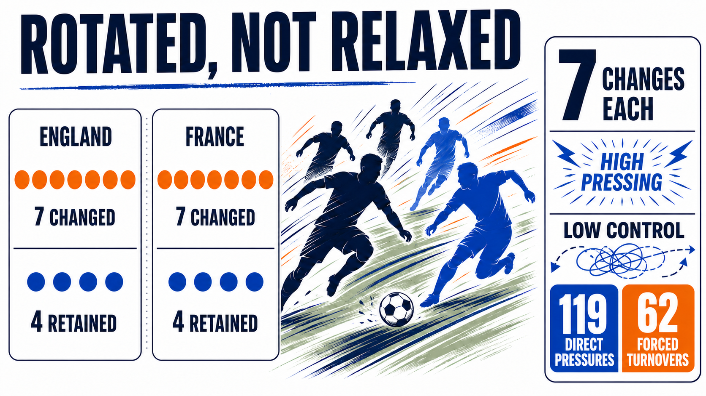

### 2. The score opened the game

The 4–0 lead encouraged risk and made the match more open. Historical scoring rates raise the expectation from 2.45 to 3.30 goals along this score path—a meaningful increase, but nowhere near the ten actually scored.

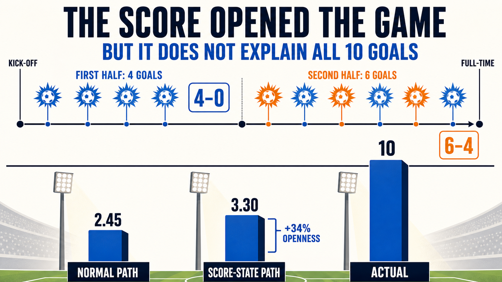

### 3. Not an ordinary friendly

Matched elite friendlies averaged almost exactly the same number of goals as matched official games. Historical third-place matches and the charity sample were higher-scoring, but this match still sat far above every comparison.

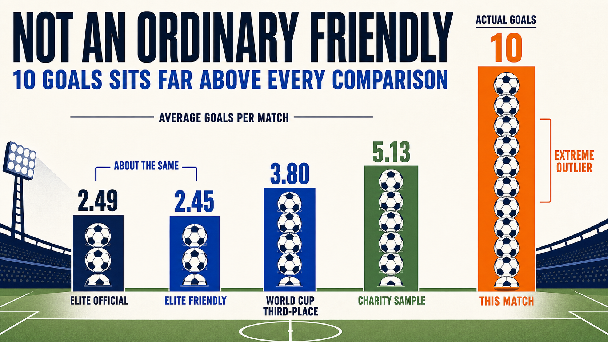

### 4. Lower team stakes, live individual rewards

The bronze medal was less valuable than a place in the final, but official goals and assists still changed Golden Boot, assist, and record standings. France's selection and the before-versus-after totals show why attacking incentives could remain strong.

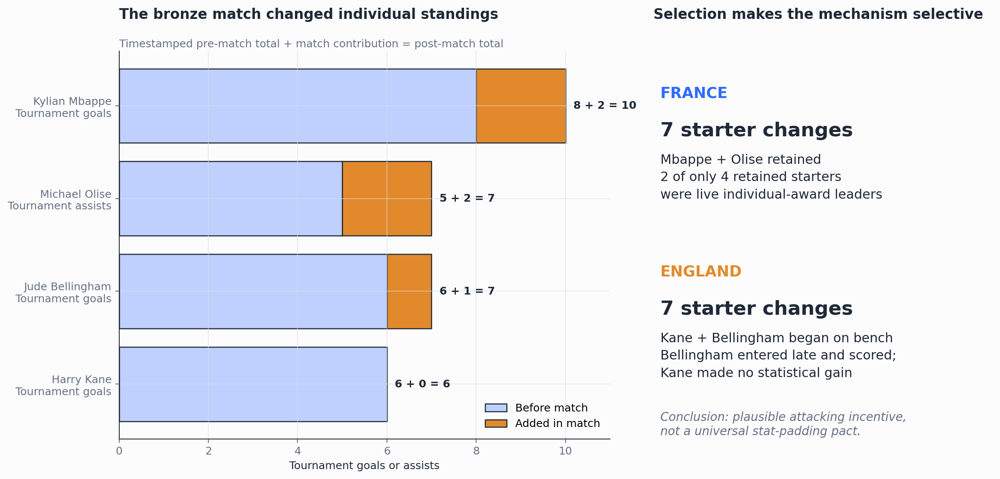

### 5. Effort remained, control failed

Fast running and direct pressure were normal-to-high for both teams. The problem was what happened around those actions: France's pressure produced its worst turnover yield, and both teams allowed their highest opponent xG of the tournament.

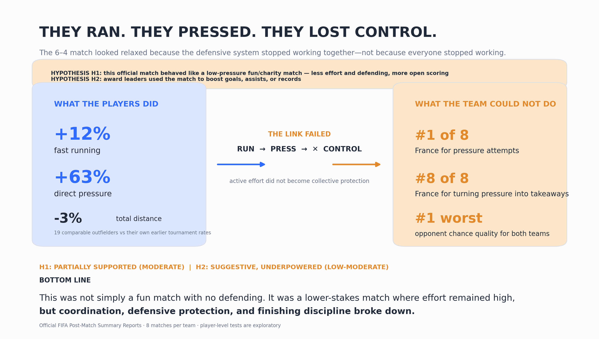

### 6. Attacking involvement plus exceptional finishing

The retained French award leaders stayed highly involved, especially Olise's movement and pressure activity and Mbappe's shot volume. The match also converted 5.33 xG into ten goals, with England supplying most of the finishing overperformance.

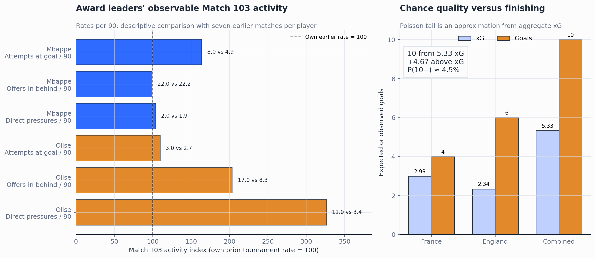

## What the larger professional comparison changes

The original comparison had only 20 historical World Cup third-place matches and 15 Soccer Aid matches. Version 2 adds a professional score backbone and constructs a primary sample of **173 neutral matched pairs** from 1991–2023.

Every pair contains:

- One senior men's professional friendly.
- One official tournament match.
- Two teams ranked in the prior-year top 30.
- A prior-year Elo difference of no more than 200 points.
- Matching on year, average Elo, and Elo gap, with neutral venue held exact.

After matching, every covariate had an absolute standardized mean difference below 0.05, comfortably inside the conventional 0.10 balance boundary.

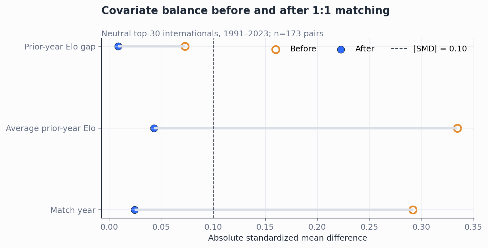

### Primary result

| Metric | Professional friendly | Official tournament |
|---|---:|---:|
| Matched matches | 173 | 173 |
| Average total goals | 2.45 | 2.49 |
| Five-plus-goal rate | 12.1% | 8.7% |
| Maximum total goals | 7 | 7 |

The paired mean difference was **−0.04 goals per match** for friendly minus official:

- Bootstrap 95% CI: **−0.35 to +0.27**
- Paired sign-flip permutation test: **p = 0.824**
- Exact paired test for the five-plus threshold: **p = 0.345**

This does not show that the contexts are identical. It shows that the data rule out a large, general “elite friendlies become goal festivals” effect. England–France's ten goals were above every score in both matched groups.

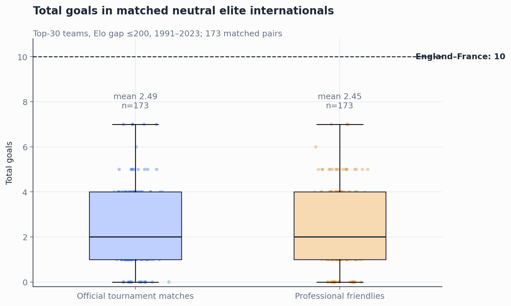

The conclusion was stable when eligibility was tightened to prior-year top 10, top 15, and top 20 teams. Those smaller samples produced uncertain estimates on both sides of zero. A separate 539-pair friendly-versus-qualifier design estimated **+0.15 goals** for friendlies, but its CI still crossed zero (**−0.04 to +0.35; p = 0.127**).

### Predictive interpretation

A smoothed count model estimated the probability of at least ten goals as:

- **0.027%** in matched official tournament matches.
- **0.076%** in matched professional friendlies.
- **0.114%** in the first 102 matches of the 2026 World Cup.
- **3.69%** in the small Soccer Aid benchmark.

The friendly estimate is about 2.8 times the matched official estimate, but both are below one-tenth of one percent. Therefore, ten goals are slightly more compatible with the friendly model in relative terms while remaining far outside an ordinary elite-friendly range in absolute terms.

The all-era World Cup tail estimates are sensitive to old, high-variance matches and extra time; they are historical context, not the primary classification result.

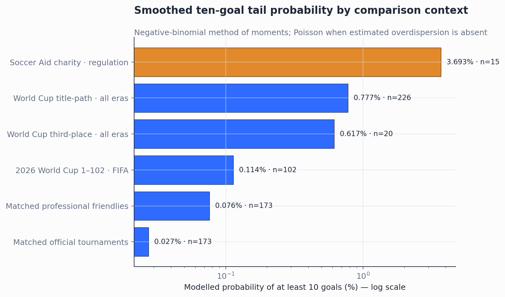

## Selection evidence: both teams rotated heavily

Official FIFA team-summary pages show that both teams retained only four semi-final starters.

| Team | Semi-final starters retained | Starter changes | Retained players |
|---|---:|---:|---|
| France | 4 | 7 | Adrien Rabiot, Kylian Mbappe, Michael Olise, Mike Maignan |
| England | 4 | 7 | Declan Rice, Djed Spence, Marc Guehi, Morgan Rogers |

Seven changes each are strong evidence that the bronze match had lower selection priority than the semi-finals. Rotation can represent fatigue management, squad reward, experimentation, or reduced consequence. It does not prove that the selected players lacked competitive intent.

## Individual incentive evidence

This is a mechanism audit rather than a statistical test. Four conditions make the argument credible: an award or record was live before kick-off, the relevant player was selected, the player added to the statistic, and the match materially changed the standing.

| Player | Pre-match stake | Selection | Match change | Consequence |
|---|---|---|---:|---|
| Kylian Mbappe | 8 goals; second to Messi on the assist tie-break | Started; retained from semi-final | +2 goals | 10 goals and provisional Golden Boot lead; 22 career World Cup goals |
| Michael Olise | Tournament assist leader with 5 | Started; retained from semi-final | +2 assists | 7 assists and an extended lead; reported single-tournament record |
| Jude Bellingham | 6 goals; fourth in FIFA's pre-match Golden Boot table | Began on bench; entered at 79' | +1 goal | England record of 7 goals at one World Cup |
| Harry Kane | 6 goals; fifth in FIFA's pre-match table | Began on bench | +0 | No statistical gain—a counterexample to a universal stat-padding claim |

The strongest version of the argument is therefore not “everyone farmed statistics.” It is:

> **Lower collective consequence weakened the cost of risk, while selective individual rewards preserved strong attacking incentives.**

France's selection is particularly revealing: despite changing seven starters, two of the four retained players were Mbappe and Olise. England's choices add an important limit because Kane and Bellingham—both on six goals—did not start. Saka's hat-trick demonstrates how much personal output the open environment allowed, but it does not by itself prove a pre-match award motive.

Sources: [FIFA's pre-match Golden Boot standings and tie-break rules](https://www.fifa.com/en/tournaments/mens/worldcup/canadamexicousa2026/articles/adidas-golden-boot-race-top-scorer), [FIFA's assist table](https://www.fifa.com/en/tournaments/mens/worldcup/canadamexicousa2026/articles/most-assists-top-assisters), [AP's post-match report](https://apnews.com/article/world-cup-england-france-third-place-score-52f94eda6ff6d268d38aaefbc446c525), and the [reported Olise assist update](https://as.com/us/futbol/mundial/michael-olise-supera-a-pele-y-rompe-record-historico-de-asistencias-en-un-mundial-f202607-n/).

## Official FIFA process evidence

The strongest process comparison uses the same provider and metric definitions: official FIFA Post-Match Summary Reports for matches 1–103.

| Match-103 metric | England–France | Earlier median | Earlier maximum | Percentile vs matches 1–102 |
|---|---:|---:|---:|---:|
| Goals | 10 | 3 | 8 | 100th |
| Total xG | 5.33 | 2.45 | 4.57 | 100th |
| Attempts | 38 | 24 | 41 | 95th |
| Shots on target | 20 | 8 | 18 | 100th |
| Completed line breaks | 221 | 183 | 252 | 91st |
| Defensive pressures | 558 | 521 | 704 | 68th |
| Direct pressures | 119 | 88 | 124 | 98th |
| Forced turnovers | 62 | 83 | 109 | 5th |
| Turnovers per 100 pressures | 11.1 | 15.6 | 27.8 | Below all earlier matches |

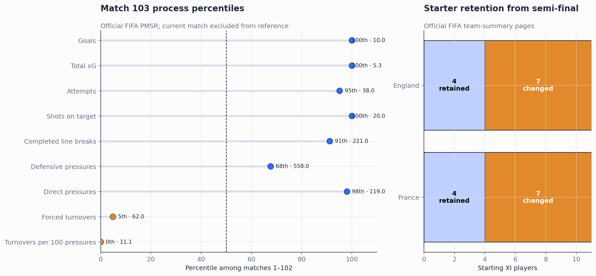

### What this means tactically

The teams were not standing off and allowing attacks without resistance:

- Direct pressures were at the **98th percentile**.
- The direct-pressure share was at the **91st percentile**.
- France applied 335 pressures compared with its prior-tournament average of approximately 234 pressures per match.

But those actions did not restore control:

- Forced turnovers were at only the **5th percentile**.
- The derived turnover yield was lower than all 102 earlier matches.
- Completed line breaks were at the **91st percentile**.
- Total xG and shots on target set tournament highs.

The most defensible interpretation is **active but ineffective defending**: aggressive pressure attempts, inadequate protection around those attempts, and repeated access through or beyond the defensive structure.

This ratio is a derived analytical proxy, not an official FIFA “pressing efficiency” statistic. A forced turnover is not mechanically attributable to one specific pressure.

## Player-level test: did the players physically coast?

The team totals cannot tell whether a few energetic players hid general passivity. To test that possibility, the analysis extracted physical, pressing, movement, and shooting rows from the official FIFA reports for **all eight France matches and all eight England matches**.

The comparison includes 19 Match-103 outfielders who:

- played at least 45 minutes in Match 103;
- had at least two earlier appearances of 15 or more minutes; and
- accumulated at least 90 earlier tournament minutes.

Each player's Match-103 rate is compared with his own pooled earlier-tournament rate. A player bootstrap gives the uncertainty interval; a two-sided sign-flip test asks whether the within-player differences are systematically away from zero. Because four related effort metrics were examined, Holm-adjusted p-values are also reported.

| Player-level metric per 90 | Match 103 mean | Own prior mean | Change | Bootstrap 95% CI for change | Raw p | Holm p |
|---|---:|---:|---:|---:|---:|---:|
| Total distance | 10.04 km | 10.37 km | −0.33 km (−3.2%) | −0.68 to +0.03 km | 0.089 | 0.179 |
| Distance at 20+ km/h | 858 m | 765 m | +92 m (+12.0%) | +9 to +176 m | 0.050 | 0.150 |
| Sprints | 43.3 | 42.5 | +0.8 (+2.0%) | −3.6 to +5.4 | 0.727 | 0.727 |
| Direct pressures | 5.98 | 3.66 | +2.32 (+63.2%) | +0.45 to +4.36 | 0.035 | 0.141 |

The evidence does **not** show broad physical coasting. Total distance was slightly lower, which is compatible with a less continuous match, but explosive distance rose, sprints stayed similar, and 13 of 19 players exceeded their own direct-pressure baseline. The raw high-intensity and pressure tests sit near conventional significance thresholds, but neither survives the multiple-outcome correction. These player tests should therefore be treated as exploratory pattern evidence, not four independent confirmatory experiments.

The same-team match rankings are less dependent on player independence and make the tactical pattern clearer:

| Match-103 rank within each team's eight matches | France | England |
|---|---:|---:|
| High-intensity distance | 2nd | 3rd |
| Direct pressures | 1st | 3rd |
| Turnover yield | 8th | 3rd |
| Opponent xG conceded | 1st/worst | 1st/worst |
| Opponent completed line breaks | 1st/worst | 2nd/worst |

France's combination is the clearest: its highest direct-pressure count and second-highest fast-running distance produced its worst pressure yield, while England created France's worst xG and line-break concession. England also worked at high intensity but allowed its own worst opponent xG. The most valuable new insight is therefore a separation between **individual effort** and **collective coordination**: the players ran and pressed, but the defensive system did not convert that work into control.

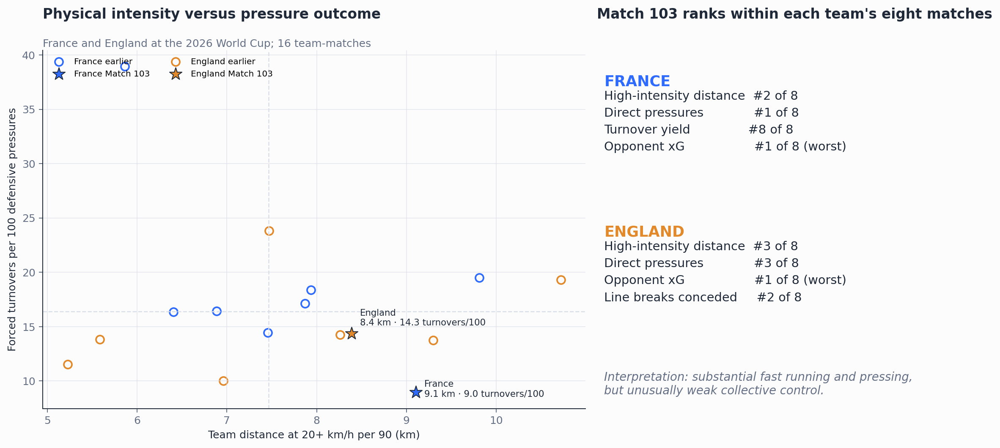

Important caveats: the 19 players share tactics, opponents, and score state, so they are not statistically independent; score state can itself change running and pressing; and FIFA's physical totals include stoppage time while the common per-90 denominator uses the regulation clock. The analysis applies that convention consistently and does not claim a causal treatment effect.

### Behavioral evidence around individual incentives

The award audit establishes that individual rewards existed. Player activity can test whether the relevant players were unusually involved, but it still cannot reveal why they chose an action.

| Player and signal | Match 103 | Earlier rate per 90 | Context |
|---|---:|---:|---|
| Kylian Mbappe attempts | 8 | 4.88 | Tied his tournament high; 42.1% of France's shots vs 27.5% earlier share |
| Michael Olise offers in behind | 17 | 8.34 | Highest of eight tournament matches |
| Michael Olise direct pressures | 11 | 3.37 | Highest of eight tournament matches |
| Bukayo Saka attempts | 5 | 2.70 | Highest raw count but second-highest per-90 rate; 26.3% of England's shots vs 8.5% earlier share |
| Jude Bellingham attempts | 2 in 11 minutes | 2.49 per 90 | Too few Match-103 minutes for a stable rate |
| Harry Kane | Did not appear | — | No opportunity to add to his total |

The within-player empirical tail checks are necessarily coarse: Mbappe's eight attempts have one-sided p=0.25 because one earlier match matched that per-90 rate; Olise's movement and pressure peaks each have p=0.125; Saka's attempt rate has p=0.286 because one shorter earlier appearance produced a higher per-90 rate. With only six or seven earlier appearances, even an unmatched peak can reach only p=0.125 or p=0.143. This is useful **behavioral triangulation**, not a claim of statistically proven stat-padding.

### Finishing amplified the openness

| Team/scope | xG | Goals | Goals above xG | Approximate Poisson tail |
|---|---:|---:|---:|---:|
| France | 2.99 | 4 | +1.01 | P(4+) = 35.1% |
| England | 2.34 | 6 | +3.66 | P(6+) = 3.2% |
| Combined | 5.33 | 10 | +4.67 | P(10+) = 4.5% |

The score was therefore a combination of two mechanisms: the teams generated unusually high-quality opportunities, then finished them unusually well. England supplied most of the overperformance. The Poisson values are rough conditional checks using aggregate xG as the scoring mean; shot-level xG and dependence between chances are unavailable, so these are not exact calibration tests.

## How much did the 4–0 score state matter?

The score-state analysis uses regulation-time goal events from 964 men's World Cup matches through 2022.

Historical scoring accelerated as the existing lead increased:

| Absolute lead at start of minute | Historical goals per 90 match-minutes |
|---|---:|
| Level | 2.36 |
| One goal | 2.76 |
| Two goals | 3.55 |
| Three or more | 4.71 |

Applying those rates to England–France gives:

| Scenario | Expected/observed goals | Match-cluster bootstrap 95% CI |
|---|---:|---:|
| Match remains level throughout | 2.45 | 2.30–2.61 |
| Actual England–France score-state path | 3.30 | 3.01–3.62 |
| Actual result | 10.00 | Not an estimate |

The evolving score therefore raised the historical expectation by approximately **0.85 goals, or 34%**. It explains part of the openness, especially France's need to chase, but not the scale of the final score. This is an associative decomposition: large leads also occur more often in team-strength mismatches, so the difference should not be read as a purely causal score-state effect.

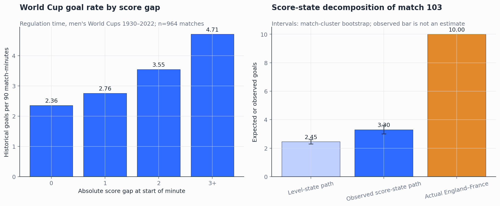

Further historical context:

- Four or more first-half goals occurred in **42 of 964 matches (4.36%)**.
- Six or more second-half goals occurred in **7 of 964 (0.73%)**.
- Ten or more regulation-time goals occurred in **4 of 964 (0.41%)**.

The match was already unusually open by half-time, before the entire second-half chase could explain the spectacle.

## Role of the charity comparison

Soccer Aid averaged 5.13 goals across 15 saved matches and had a previous maximum of nine. England–France exceeded all of them.

This remains useful as a face-validity anchor: the bronze match reached an exhibition-like scoring level. It is not evidence that the football itself was equivalent. Soccer Aid combines celebrities and former professionals, uses different roster construction, and has different incentives. Adding more unrelated charity games would improve the precision of the charity average but would not fix that validity problem.

## Final evidence scorecard

| Claim | Assessment |
|---|---|
| The match had lower selection priority than the semi-finals | **Supported** |
| Elite friendlies normally score much more than official tournament matches | **Not supported** |
| The scoreline was exhibition-like | **Supported descriptively** |
| The players broadly coasted physically | **Not supported; high-intensity work and direct pressure rose** |
| The teams made no defensive effort | **Contradicted by pressure and physical activity** |
| Defensive control was exceptionally poor | **Supported** |
| Award leaders displayed unusually aggressive activity | **Suggestive, not conclusive** |
| Chance creation alone explains ten goals | **Not supported; finishing added 4.67 goals above xG** |
| The 4–0 game state explains all ten goals | **Contradicted** |
| The match fits an ordinary elite friendly | **Not supported** |

## Confidence assessment

**Overall status: share with caveats.**

- **High confidence:** score, lineup rotation, official FIFA process metrics, physical-table extraction, report reconciliation, and the focal teams' within-tournament ranks.
- **Moderate confidence:** matched professional score comparison, historical score-state decomposition, and the qualitative effort-versus-control diagnosis.
- **Low confidence:** corrected player-level hypothesis-test significance, any statement about private player motivation, or exact equivalence to charity football.

The most important remaining data gap is timestamped event and tracking data. It would show whether spacing, counter-press protection, and defensive recovery deteriorated before the score became 4–0 or mainly as a consequence of it. A same-provider event dataset for elite professional friendlies would also allow pressure, transition, line-break, and defensive-structure classification across contexts—not merely score comparisons. Other competitions' placement matches require a reliable stage-labelled source before hierarchical pooling is defensible.

## Source notes

- [FIFA match-103 Post-Match Summary Report](https://www.fifatrainingcentre.com/media/native/tournaments/fifa-world-cup/2026/PMSR-M103-FRA-V-ENG.pdf)
- [FIFA Training Centre report library](https://www.fifatrainingcentre.com/), used for all eight France and all eight England matches; exact report URLs are in the source manifest
- [FIFA's Norway–France report](https://www.fifa.com/en/tournaments/mens/worldcup/canadamexicousa2026/articles/ousmane-dembele-hat-trick-norway), used only to recover Ousmane Dembele's 65th-minute substitution when the crowded PDF row omitted it
- [Mart Jürisoo international-results repository](https://github.com/martj42/international_results), pinned locally at commit `80f408d2c93ba4f9e06a2c7cdc5effb05fea9680`
- [JGravier soccer-Elo repository](https://github.com/JGravier/soccer-elo), pinned sibling data at commit `a24d031e0ed81cbb4206ff84a2209bbf000ee6d6`
- [Fjelstul World Cup Database](https://github.com/jfjelstul/worldcup), pinned sibling data at commit `35a8667f518b07469182ae16d35574dd0e7a00fb`
- Source paths, coverage rules, and known gaps are recorded in `data/source_manifest_v2.json`.
