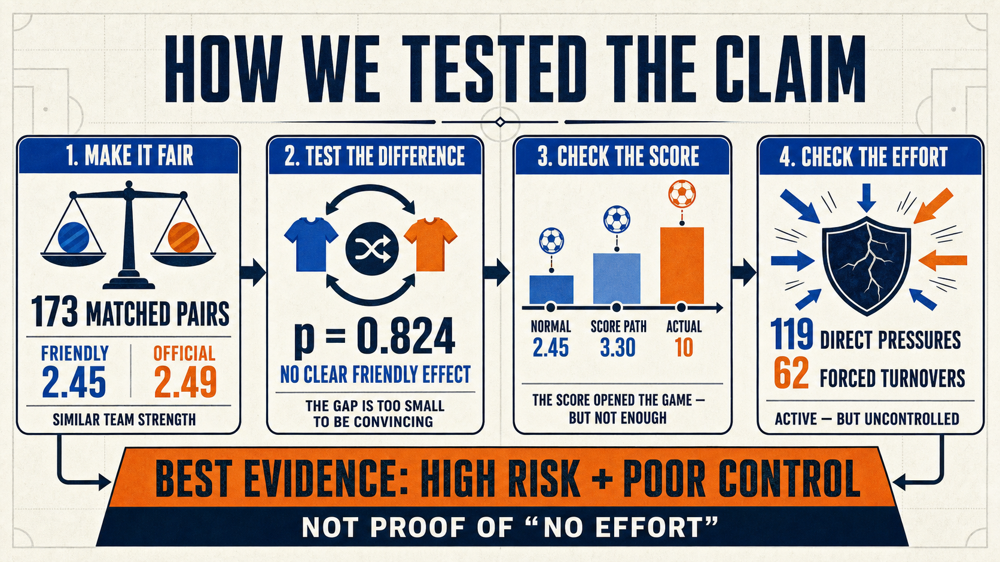

# England–France 6–4: statistical tests, evidence, and method

Analysis date: 19 July 2026  
Primary notebook: `jupyter-notebook/england_france_2026_third_place_analysis_v2.ipynb`



## What this analysis can and cannot prove

The analysis cannot observe private motivation. No statistical test can prove that players were “having fun,” “not trying,” or deliberately stopped defending.

What it can test is whether the match looked different from carefully chosen serious-match comparisons, whether the scoreline was unusually extreme, and whether the match process showed effort or defensive activity.

The evidence supports this wording:

> **England–France was a lower-stakes, heavily rotated official match with high attacking risk, aggressive pressure attempts, and unusually weak defensive control. Its scoring looked exhibition-like, but the process data do not look like passive play.**

## Plain-language guide to the statistics

- **Mean difference:** how many more goals one setting produced on average. Here, “friendly minus official.”
- **95% confidence interval:** a reasonable uncertainty range around the estimated difference. If it crosses zero, the data are compatible with either side of zero.
- **p-value:** how surprising the observed difference would be if there were no systematic difference between the settings. A large p-value is not proof that the settings are identical; it means the data do not provide strong evidence of a difference.
- **Matched pair:** a friendly and an official match made comparable on team strength, year, neutral venue, and Elo gap. Matching reduces obvious apples-to-oranges bias.
- **Percentile:** where the current match sits relative to the first 102 matches of the same World Cup using the same FIFA report definitions.

## 1. Primary professional comparison

### Question

Do elite professional friendlies generally produce more goals than serious official tournament matches?

### Design

The primary sample contains **173 matched pairs** from 1991–2023. Each pair contains:

- one senior men's professional friendly;
- one official tournament match;
- neutral venue in both matches;
- teams in the prior-year top 30;
- prior-year Elo difference of no more than 200 points;
- matching on year, average Elo, and Elo gap.

After matching, every recorded covariate had an absolute standardized mean difference below 0.05. The conventional balance warning line is 0.10.

### Test A: paired bootstrap for the mean goal difference

For every pair, the analysis calculated:

```text
goal difference = friendly goals − official goals
```

It then resampled the 173 paired differences with replacement **20,000 times**. The 2.5th and 97.5th percentiles formed the bootstrap 95% interval.

| Result | Value |
|---|---:|
| Friendly average | 2.4509 goals |
| Official average | 2.4913 goals |
| Friendly minus official | −0.0405 goals |
| Bootstrap 95% interval | −0.3526 to +0.2659 |

The estimate is effectively zero relative to the uncertainty. The interval does not support a large general “friendlies become goal festivals” effect.

### Test B: paired sign-flip permutation test

The null hypothesis is that there is no systematic friendly-versus-official difference within matched pairs. Under that null, each pair’s difference can be randomly left as-is or have its sign flipped. The analysis performed **20,000 random sign-flip draws** and calculated a two-sided p-value.

**Result: p = 0.824.**

Interpretation: a difference at least as extreme as −0.04 goals is very unsurprising if the two contexts have no general scoring difference. We do not reject the no-difference hypothesis.

This is not the same as proving that friendlies and official matches are identical. The interval still allows a modest difference in either direction.

## 2. Five-plus-goal threshold test

### Question

Are friendlies more likely to become high-scoring matches, even if their average goal totals are similar?

The matched results were converted into a simple indicator: total goals were either **5 or more** or **below 5**.

| Context | 5+ goal rate |
|---|---:|
| Professional friendlies | 12.1% |
| Official tournament matches | 8.7% |

Because the observations are paired, the analysis used an exact paired **McNemar-style binomial test**. It only counts pairs where one context crosses the threshold and the other does not; pairs where both are high-scoring or both are not do not create directional evidence.

**Result: p = 0.345.**

The friendly rate is descriptively higher, but the paired threshold evidence is not strong enough to rule out ordinary sampling variation.

## 3. Design sensitivity checks

The result should not depend on one arbitrary definition of “elite.” The notebook repeated the primary design using prior-year top-10, top-15, and top-20 teams, plus a larger friendly-versus-qualifier design.

| Design | Pairs | Friendly − official | 95% interval | p-value |
|---|---:|---:|---:|---:|
| Neutral, top 10 | 23 | +0.30 | −0.39 to +1.00 | .472 |
| Neutral, top 15 | 55 | +0.00 | −0.49 to +0.49 | 1.000 |
| Neutral, top 20 | 86 | +0.08 | −0.31 to +0.48 | .726 |
| Neutral, top 30 | 173 | −0.04 | −0.36 to +0.27 | .825 |
| Top 30 friendly vs qualifier | 539 | +0.15 | −0.04 to +0.35 | .127 |

The point estimates move around because the tighter samples are small, but every interval includes zero. The larger design is more precise and still does not establish a statistically reliable friendly scoring advantage.

## 4. How rare was ten goals?

The notebook fitted smoothed count models to estimate the probability of reaching at least ten total goals. These are model-based tail probabilities, not direct frequencies and not substitutes for the paired tests.

| Context | Matches | Average goals | Highest saved score | Smoothed P(total ≥ 10) |
|---|---:|---:|---:|---:|
| Matched official tournaments | 173 | 2.49 | 7 | 0.027% |
| Matched professional friendlies | 173 | 2.45 | 7 | 0.076% |
| 2026 World Cup matches 1–102 | 102 | 2.91 | 8 | 0.114% |
| World Cup third-place matches, all eras | 20 | 3.80 | 9 | 0.617% |
| Soccer Aid charity sample | 15 | 5.13 | 9 | 3.69% |

England–France scored **10**, exceeding every saved match in the matched professional groups and every saved Soccer Aid match. Ten goals are relatively more compatible with the friendly model than the official model, but both professional-model probabilities are far below one-tenth of one percent.

The charity comparison is useful as a descriptive exhibition-like anchor, but it is not a valid causal control group: it has different rosters, incentives, player experience, and match conditions.

## 5. Score-state analysis

### Question

Could an early 4–0 lead explain why the match became so open?

The analysis used **964 regulation-time World Cup matches through 2022**. For each minute, it recorded the absolute score gap at the start of that minute and estimated historical goals per 90 minutes:

| Score state | Historical goals per 90 |
|---|---:|
| Level | 2.36 |
| One-goal gap | 2.76 |
| Two-goal gap | 3.55 |
| Three-plus gap | 4.71 |

Those rates were applied to two counterfactual paths:

- **Level-state path:** expected 2.452 goals.
- **Actual England–France score-state path:** expected 3.297 goals, with a match-cluster bootstrap interval of 3.011–3.618.
- **Observed result:** 10 goals.

The score path raised expected scoring by approximately **0.85 goals, or 34%**, but it did not explain the scale of the final score.

The notebook used **5,000 match-cluster bootstrap resamples**, so whole historical matches—not individual minutes—were resampled together.

Important limitation: score state is endogenous. A big lead is related to team strength, matchups, and the events that already happened. This is an explanatory decomposition, not a causal experiment saying that the 4–0 score independently caused exactly 0.85 extra goals.

## 6. FIFA process evidence: effort versus control

The process comparison uses the same FIFA Post-Match Summary Report format for World Cup matches 1–103. Match 103 is England–France; matches 1–102 are the reference distribution.

| Metric | England–France | Position among matches 1–102 |
|---|---:|---:|
| Goals | 10 | 100th percentile |
| Total xG | 5.33 | 100th percentile |
| Attempts | 38 | 95th percentile |
| Shots on target | 20 | 100th percentile |
| Completed line breaks | 221 | 91st percentile |
| Direct pressures | 119 | 98th percentile |
| Forced turnovers | 62 | 5th percentile |
| Forced turnovers per 100 pressures | 11.1 | Below all earlier matches |

This is not a formal hypothesis test because the FIFA process sample is a single current match compared with a tournament reference distribution. It is strong descriptive evidence of the pattern:

- very active attacking and pressure attempts;
- unusually poor conversion of pressure into forced turnovers;
- unusually high access, chance creation, and defensive instability.

That pattern is more consistent with **active but ineffective defending** than with “nobody tried.”

## 7. Selection evidence

Official FIFA team summaries show that both countries retained only four semi-final starters and changed seven:

| Team | Semi-final starters retained | Starter changes |
|---|---:|---:|
| France | 4 | 7 |
| England | 4 | 7 |

This is strong descriptive evidence that the bronze match had lower selection priority than the semi-finals. It does not identify whether the reason was fatigue, squad rotation, experimentation, reward, or lower competitive pressure.

## 8. Data-quality checks

The notebook ran consistency checks before promoting results into the report:

| Check | Result |
|---|---:|
| International result rows with parseable dates | 49,520 / 49,520 |
| Unique men's World Cup match IDs | 964 / 964 |
| World Cup goal events reconcile to final scores | 964 / 964 |
| FIFA baseline has two team rows per match | 96 / 96 |
| Starter groups contain exactly 11 players | 4 / 4 |
| Current match timeline contains ten goals | 10 / 10 |

One expected gap remains: the current match is held in a separate current-match source rather than being fully populated in the historical results backbone. The current score, timeline, FIFA process data, and lineup data are nevertheless checked separately and reconciled in the notebook.

## Final evidence judgment

| Claim | Evidence judgment |
|---|---|
| The match had lower selection priority than the semi-finals | Supported by seven changes for both teams |
| Elite friendlies are normally much more goal-heavy | Not supported by matched mean or threshold tests |
| The match looked exhibition-like in its scoring | Supported descriptively; ten goals exceeded all saved professional and charity comparison rows |
| The teams made no defensive effort | Not supported; direct pressure was at the 98th percentile |
| Defensive control was unusually poor | Supported by very low forced-turnover yield and high attacking access |
| The 4–0 state explains all ten goals | Not supported; expected scoring rose to about 3.30, not 10 |
| The match was an ordinary elite friendly | Not supported; ten goals were an extreme professional-model tail event |

## Reproducibility files

- Notebook: `output/jupyter-notebook/england_france_2026_third_place_analysis_v2.ipynb`
- Source manifest: `data/source_manifest_v2.json`
- Matched pairs: `data/processed/matched_neutral_elite_friendlies_vs_officials.csv`
- Summary metrics: `output/tables/v2_summary_metrics.json`
- Evidence scorecard: `output/tables/v2_evidence_scorecard.csv`
- Score-state decomposition: `output/tables/v2_score_state_decomposition.csv`
- Tail probabilities: `output/tables/v2_ten_goal_tail_probabilities.csv`

The notebook was executed top-to-bottom successfully before these results were documented.
